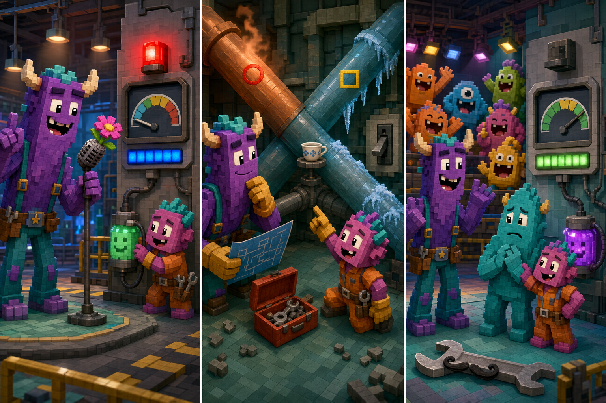

# Monsters at Work: The Warm Laugh Pipe

## Part 1: A Strange Warning

Tylor Tuskmon and Val Little were preparing Practice Room Four at Monsters, Incorporated. Three new Jokesters were coming after lunch, and they needed a safe place to test their jokes. Tylor checked the microphone while Val connected a small laugh canister to the wall.

“Everything is ready,” Tylor said. He told a joke about a monster with six wet socks. Val laughed, and the canister began to fill. However, a blue warning light suddenly flashed above the door. The laugh meter fell back to zero.

Val looked at the pipes. “The laughter entered the machine, but it did not reach the canister.”

They called Fritz, who asked them to close the room until MIFT found the problem. Tylor felt disappointed because he wanted the new Jokesters to enjoy their first visit.

## Part 2: Following the Heat

Tylor and Val went behind the wall with a tool box and a pipe map. Two pipes crossed above them. One had a red circle on it, and the other had a yellow triangle.

The map said that laugh power should travel through the pipe with the yellow triangle. However, that pipe felt cold. The red-circle pipe was warm and made a soft humming sound.

“The warm pipe must be carrying the laugh power,” Val said. “Someone connected them the wrong way.”

Tylor wanted to move the connections immediately, but Val stopped him. First, they switched off the power. Then they put on thick safety gloves and checked the map again. Together, they moved each connection to the correct pipe.

## Part 3: More Than a Joke

After lunch, the new Jokesters entered Practice Room Four. Tylor tested the system with his wet-socks joke again. This time, the meter rose steadily, and the canister shone with bright yellow light.

The visitors cheered. One nervous Jokester forgot her joke, so Tylor invited Val to stand beside her. Val made a funny face, and everyone laughed even more.

Fritz thanked them for repairing the pipes carefully. Tylor smiled. He had always believed that the funniest monster did the most important job. Now he understood that good jokes needed a safe, working factory too. The practice continued, and the warning light stayed off for the rest of the afternoon.

## Useful A2 Words

- **connect**: to join two things together.
- **steadily**: in an even and controlled way.
- **warning**: something that tells you about possible danger or trouble.

## Reading Questions

1. Why was Tylor disappointed when Fritz closed the practice room?
   - A. He wanted the new Jokesters to have a good first visit.
   - B. He had planned to take the laugh canister home.
   - C. He thought Val did not enjoy his wet-socks joke.

2. What helped Val discover which pipe carried the laugh power?
   - A. The correct pipe was colder than the other one.
   - B. The wrong pipe was warm and made a quiet sound.
   - C. The blue warning light pointed toward the pipe map.

3. What did Tylor understand after the system worked again?
   - A. New Jokesters should practise without microphones.
   - B. A joke is useful only when every monster understands it.
   - C. Repair work is important because it allows Jokesters to do their jobs.

4. What is the main idea of the whole story?
   - A. Careful teamwork can solve a problem and help other people succeed.
   - B. A funny performance is always more useful than technical knowledge.
   - C. Workers should continue using a machine when a warning light appears.

## Picture Hunt

There are two picture mistakes in each panel. Can you find all six?

