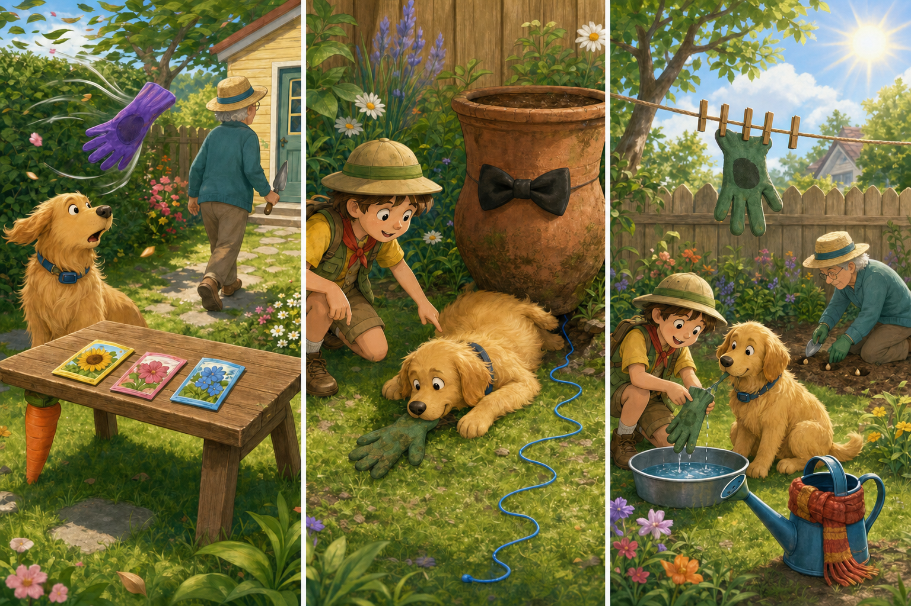

# Dug Days: The Missing Garden Glove

## Part 1: Something in the Hedge

Carl planned to plant three packets of flower seeds in the backyard. He placed a green gardening glove on the bench and went inside to get a small spade. Dug waited beside the bench and promised to guard everything.

A strong wind lifted the glove into the air. It turned twice and disappeared inside the hedge.

“A small green creature has taken Carl's hand cover!” Dug cried. He pushed his nose between the leaves, then searched behind every plant. In his excitement, he dug several holes near the fence.

Carl returned without the glove. Dug lowered his head because he had promised to protect it.

## Part 2: Russell's Plan

Russell came through the garden gate and listened. Dug wanted to dig under the whole hedge, but Russell stopped him.

“If the wind carried the glove, it probably left clues,” Russell said.

Russell noticed a green thread on a branch. Dug smelled it and followed the same smell across the grass. Near an old flower pot, they found another thread and a line in the soil.

The glove was trapped behind the heavy pot. Russell could not reach it. Dug lay flat and pulled the glove from the small space with his teeth.

It was muddy, but it was not torn.

## Part 3: Three Useful Holes

Dug carried the glove to Carl. “I did not guard it correctly, but Russell helped my nose think more slowly,” he explained.

Russell rinsed the glove in a shallow bowl while Dug held one end. They hung it in the sunshine with two wooden pegs.

Carl saw that Dug's holes were almost the right distance apart for the three packets of flower seeds. He made each hole wider and planted the seeds.

Dug felt better. Running everywhere had not found the glove, but following clues had worked. His mistake had also become useful after Carl changed the plan.

Dug sat beside the three new garden places. This time, when the leaves moved, he watched them carefully before deciding that they were creatures.

## Useful A2 Words

- **hedge**: a line of bushes growing close together.
- **clue**: something that helps you find an answer.
- **rinse**: to wash something quickly with clean water.

## Reading Questions

1. Why did Dug believe a creature had taken the glove?
   - A. He saw the wind move it into the hedge.
   - B. Carl told him that an animal lived near the bench.
   - C. He found green threads beside the garden gate.

2. Why did Russell stop Dug from digging under the whole hedge?
   - A. He wanted Dug to wait until the glove was dry.
   - B. He believed they could follow clues to the correct place.
   - C. He needed the spade to make the old flower pot wider.

3. How did Carl make Dug's earlier mistake useful?
   - A. He planted seeds in the holes Dug had made.
   - B. He used the loose soil to clean the muddy glove.
   - C. He moved the hedge into a different part of the garden.

4. What does the whole story show about solving problems?
   - A. Moving quickly is useful when an object disappears.
   - B. A promise is more important than asking somebody for help.
   - C. Careful thinking can guide energy in a better direction.

## Picture Hunt

There are two picture mistakes in each panel. Can you find all six?

