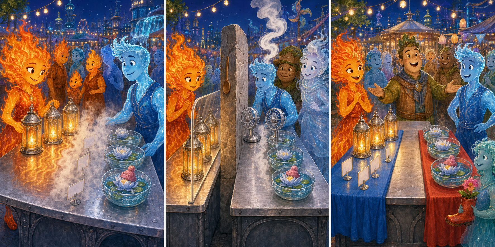

# Elemental: The Shared Festival Table

## Part 1: One Table, Two Needs

Ember and Wade volunteered at an evening fair in Element City. They had to prepare one long silver table where visitors could collect information and rest.

Ember brought four glowing glass lanterns for one end of the table. Wade placed three bowls of water flowers at the other end. At first, the arrangement looked beautiful.

Then the lantern heat travelled through the metal table. Wade's water began to bubble, and thick steam covered the small information cards. If they moved the lanterns away, the fire visitors would lose their warm light.

“We need both parts of the table,” Wade said, “but they need different conditions.”

## Part 2: Testing a Better Plan

Ember moved the lanterns farther left, while Wade moved the flower bowls farther right. However, the middle of the table still became hot.

Wade tried adding cold water, but a wave almost reached the lanterns. Ember quickly covered them with a glass shield. They agreed to stop and think before trying again.

An earth stall owner lent them a thick stone board. An air neighbour offered a small fan. Ember placed the stone board upright in the centre as a divider. It stopped much of the heat from travelling across the table.

Wade turned the fan toward the space above the bowls. It carried the steam upward instead of across the information cards. They waited five minutes and checked both sides carefully.

## Part 3: Space for Everyone

The lanterns continued to glow, but the water flowers stayed cool. The information cards were dry and easy to see. Ember added a red cloth under the lanterns, and Wade used a blue cloth under the bowls so visitors could understand the arrangement quickly.

When the fair opened, fire families enjoyed the warm side while water visitors rested near the flowers. Earth and air visitors used the clear middle space.

The fair manager thanked Ember and Wade for making one table suitable for everyone. Wade said their first idea had treated the whole table in the same way. Ember explained that sharing did not mean every part had to be identical.

They had succeeded because they tested their ideas, noticed danger, and listened to neighbours with different skills.

## Useful A2 Words

- **arrangement**: the way things are placed or organised.
- **divider**: something that separates one space from another.
- **suitable**: right or helpful for a particular purpose.

## Reading Questions

1. Why did Ember and Wade need to change their first arrangement?
   - A. The flower bowls were too heavy for the metal table.
   - B. Heat caused the water to bubble and steam covered the cards.
   - C. The fair manager wanted all four lanterns in the centre.

2. What did the stone board and fan do together?
   - A. They separated the heat and moved the steam away from the cards.
   - B. They changed the lantern light from red to blue.
   - C. They made the table longer for earth and air visitors.

3. What showed that the final arrangement was successful?
   - A. Every visitor chose to stand on the same side.
   - B. Wade removed the water flowers before the fair opened.
   - C. The lanterns stayed bright while the flowers and cards remained safe.

4. What does the whole story suggest about sharing a space?
   - A. Everyone must use a shared place in exactly the same way.
   - B. A thoughtful plan can respect different needs at the same time.
   - C. The safest solution is to separate people completely.

## Picture Hunt

There are two picture mistakes in each panel. Can you find all six?

