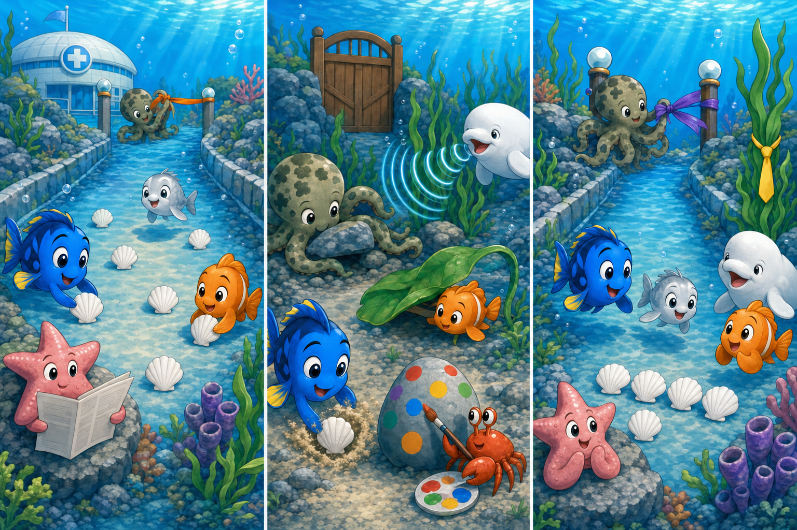

# Finding Dory: The Five Shell Path

## Part 1: A Safe Practice Route

At the Marine Life Institute, a young silver fish named Pippa was ready to leave the recovery pool. Before returning to the ocean, she needed to practise swimming through a longer channel.

Dory offered to guide her. Nemo placed five white shells along the safe route, and Hank tied an orange ribbon beside the gate to the practice pool.

“Follow the shells until you see the ribbon,” Dory told Pippa.

Just before they began, a strong current rushed through the channel. It rolled the shells under rocks and plants. The water became calm again, but the route had disappeared.

Dory remembered the orange ribbon, but she could not remember which turn came first. Pippa looked worried, so Dory decided not to guess.

## Part 2: Different Kinds of Help

The friends searched together. Hank changed colour beside the rocks and reached into narrow spaces with his arms. He found three shells. Nemo discovered a fourth shell under a wide leaf.

The last shell was missing, and tall water plants hid the practice-pool gate. Bailey listened carefully and sent a sonar sound through the channel. The sound returned from the metal gate, showing them where it was.

Dory swam toward the sound and found the fifth shell inside a small sandy hole. Then Nemo counted all five shells before anyone moved them.

“We know the correct ending now,” Dory said. “Let us make the beginning easier too.”

## Part 3: A Route to Remember

They placed the shells closer together, where the current could not easily move them. Hank fixed the orange ribbon more tightly. Dory also made a short line to remember: “Five white shells, orange at the end, swim slowly with a friend.”

Pippa repeated the words and entered the channel beside Dory. She passed every shell, saw the ribbon, and reached the practice pool safely.

The workers at the institute liked the new route because young animals could understand it quickly. Dory had not remembered every turn, but she had stopped, asked for help, and improved the plan.

Pippa thanked everyone. Dory smiled because each friend had used a different skill, and all those skills had pointed in the same direction.

## Useful A2 Words

- **route**: the way from one place to another.
- **current**: water that moves strongly in one direction.
- **signal**: an action or object that gives information.

## Reading Questions

1. Why did Dory decide not to lead Pippa immediately?
   - A. The current had removed the markers, and Dory was unsure of the first turn.
   - B. Pippa wanted to practise without another fish beside her.
   - C. Hank had moved the orange ribbon to a different pool.

2. How did Bailey help the group find the correct gate?
   - A. He counted the shells that Nemo had collected.
   - B. He used sonar to hear where the metal gate was.
   - C. He pushed the tall plants away from the channel.

3. What made the new route easier for Pippa to follow?
   - A. The friends removed every rock and plant from the water.
   - B. Dory carried Pippa through the difficult part of the channel.
   - C. The shells were closer together, and Dory created a memory line.

4. What is the main message of the whole story?
   - A. Different abilities can work together to make a safer plan.
   - B. A good guide must remember every detail without help.
   - C. Difficult routes should be closed instead of improved.

## Picture Hunt

There are two picture mistakes in each panel. Can you find all six?

