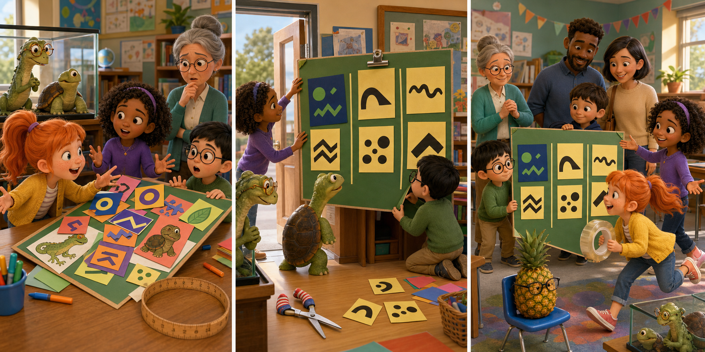

# Leo: The Doorway Display

## Part 1: Too Many Ideas

Ms Malkin told the class to make a display for Family Afternoon. It had to show what the students had learned together. Jayda wanted a perfect plan, Summer had colourful ideas, and Eli offered to draw animals. Everyone began quickly, but they spoke at the same time.

By lunch, the board was crowded. Some cards covered pictures, the letters were too small from the doorway, and no one knew what to read first. Ms Malkin asked them to improve it by the next afternoon.

Leo watched from the glass tank. When the room became quiet, he told Squirtle, "They have many good ideas, but no shared order."

## Part 2: The Doorway Test

During independent reading, Leo asked Summer to collect one idea from each classmate before giving another of her own. He asked Jayda to sort the cards into three groups: what they learned, how they helped, and what they wanted to try next. Eli put each group on a different part of the board.

Squirtle walked to the doorway and stretched his neck. He could not read green words on a dark blue card. The students tested the display from there and found two more cards that were hard to see. They changed them to black words on pale yellow paper.

Then one corner fell forward. Instead of starting again, Eli used two strong clips and asked Jayda to check the other corners. The class worked calmly and listened before making changes.

## Part 3: Everyone Has a Part

At Family Afternoon, visitors followed the display sections easily. Summer welcomed them but paused after each question, giving quieter classmates time to speak. Jayda explained the order, and Eli showed his drawings.

A small child touched the bottom card, and one clip came loose. Eli held the board while Summer found a spare clip and Jayda guided visitors to another section. They solved the problem without confusion.

Ms Malkin said the display was clear because everyone had helped to test it. A visitor asked who had the best idea. The students looked at one another and answered, "None of it would work alone."

Back in the tank, Squirtle said the students had learned more than how to arrange paper. Leo agreed. Listening had turned their different ideas into one strong plan.

## Useful A2 Words

- **display**: a collection of things arranged for people to look at.
- **sort**: to put things into groups in an organised way.
- **spare**: extra and ready to use if something is needed.

## Reading Questions

1. What was the main problem with the first display?
   - A. The class had no pictures or cards to put on it.
   - B. The many ideas were not arranged in a clear shared order.
   - C. Ms Malkin wanted the display in a different classroom.

2. Why did the students look at the display from the doorway?
   - A. They wanted to check whether visitors could read it from there.
   - B. They needed to decide where Squirtle should sleep that afternoon.
   - C. They were waiting for Mrs Malkin to bring more drawing paper.

3. What did the class show when the clip came loose?
   - A. They could use different jobs to solve a problem calmly.
   - B. They needed Leo to tell each person exactly what to do.
   - C. They cared more about the visitors than about the display.

4. What does the whole story suggest about successful group work?
   - A. The person with the first idea should make every decision.
   - B. A group works best when everyone creates the same kind of thing.
   - C. Listening, testing, and using different skills can improve a shared plan.

## Picture Hunt

There are two picture mistakes in each panel. Can you find all six?

