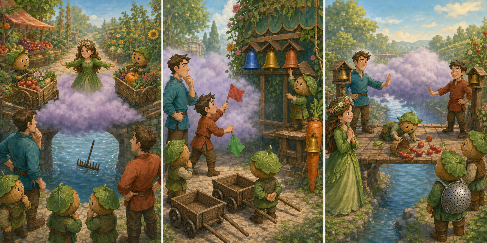

# The Super Mario Bros. Movie: The Three-Bell Bridge

## Part 1: Trouble in the Cloud

Princess Peach asked Mario and Luigi to help at a market beside the Mushroom Kingdom gardens. Farmers brought baskets of apples, mushrooms, and flowers across a narrow wooden bridge.

Soon, a low white cloud covered the river and hid the middle of the bridge. Toads at opposite ends could not see each other. Two carts started across together and nearly met. The bridge allowed only one cart, so neither could pass. Peach closed it before an accident happened.

Mario suggested moving the market, but the farmers would lose time. Luigi studied the waiting carts. "We do not need to see across the bridge if everyone understands the same signal," he said.

## Part 2: Sounds That Everyone Knows

Toad brought red and green flags, but the cloud hid their colours. Peach called instructions, yet her voice echoed under the bridge, and some Toads moved at the wrong moment.

From a nearby music stall, Luigi heard three bells with different sounds. He made a plan. One deep ring meant "wait". Two light rings meant a cart from the garden side could cross. Three quick rings meant a cart from the market side could cross.

They tested the plan without baskets. At first, the wind rang the light bells by itself. A Toad carpenter built small wooden covers, so the wind could not ring them. Mario and Luigi practised with the drivers until nobody moved too early.

## Part 3: A Safe Way Across

Peach reopened the bridge. Luigi stayed at the garden end and Mario stood at the market end, each beside covered bells. When Luigi gave two light rings, Mario held his carts back. After the cart arrived, he answered with one deep ring. Then Mario used three quick rings for the other direction.

The cloud remained, but deliveries continued calmly. When a young Toad dropped a flower basket in the middle, both brothers gave the deep wait signal. They collected the flowers together and returned before traffic began again.

At sunset, the farmers had delivered every basket. Peach thanked the team for a plan people could hear, practise, and trust. Mario said fast feet had not solved the problem; clear communication had. Luigi smiled because his quiet idea kept the bridge safe.

## Useful A2 Words

- **narrow**: not wide; having only a small space from side to side.
- **signal**: an action or sound that gives information.
- **trust**: to believe that someone or something is safe and reliable.

## Reading Questions

1. Why did Peach close the bridge in Part 1?
   - A. The cloud made it unsafe for two carts to use the narrow bridge.
   - B. The farmers had brought their baskets to the wrong market.
   - C. Mario needed the bridge for a race with Luigi.

2. Why did the Toad carpenter put covers over the bells?
   - A. To make each bell produce a deeper sound.
   - B. To stop the wind from giving a signal by mistake.
   - C. To hide the bells from people at the music stall.

3. What did Mario and Luigi do when the flower basket fell?
   - A. They stopped both sides before going onto the bridge to help.
   - B. They asked Peach to move the market to the gardens.
   - C. They continued the signals while the young Toad worked alone.

4. What is the main lesson of the whole story?
   - A. A clear system can work well when people practise and follow it.
   - B. A difficult journey becomes easier when people move very quickly.
   - C. A market should close whenever the weather changes suddenly.

## Picture Hunt

There are two picture mistakes in each panel. Can you find all six?

