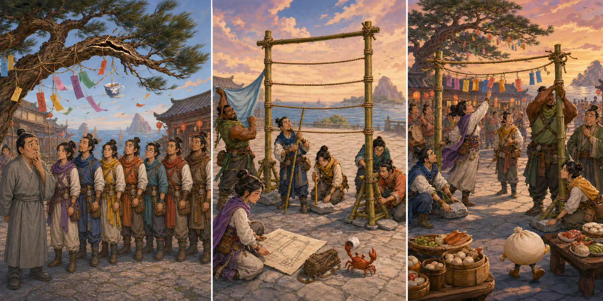

# All Wishes Come True!: The Bamboo Wish Arch

## Part 1: A Tree in the Wind

The eight travellers stopped at a seaside village on their way to Penglai. The village was preparing an evening festival, and children were tying paper wishes to an old pine tree.

Lu Dongbin noticed a long crack in one branch. Strong wind moved it above the children. When a child reached for a hanging rope, He Xiangu guided her away.

The village leader wanted to cancel the festival, but Lan Caihe had another idea. "The wishes do not need this tree," the youngest traveller said. "We can give them a safer home."

The group decided to build a wish arch in the empty square. They had no magic solution, so each traveller offered a practical skill.

## Part 2: Eight People, One Frame

Zhongli Quan carried thick bamboo poles. Han Xiangzi measured them, and Cao Guojiu drew a plan. Their first arch was tall and narrow, so the wind pushed it sideways when they added practice cards.

Tieguai Li found several flat stones. Zhang Guolao suggested wider feet for the arch and placed the stones on them. He Xiangu tied strong knots, Lan Caihe added three lines for wishes, and Lu Dongbin marked a safe path around the work area.

To test the design, Zhongli Quan held up a wide cloth like a sail. Wind pushed against the arch, but it stayed upright. The travellers checked every knot before inviting the children back.

## Part 3: Wishes Without Magic

At sunset, the bamboo arch stood in the square. The children hung wishes on its three lines, away from the damaged branch.

A sudden wind loosened the top rope. He Xiangu reached towards it but did not hold the moving arch alone. Lu Dongbin asked two friends to steady the feet while Zhongli Quan tightened the knot.

The festival opened with music and food. The old pine rested without ropes on its branches. The village leader thanked the travellers and said their work looked almost magical.

Lan Caihe smiled. The wishes stayed safe because eight ordinary people noticed different problems and shared their skills. They had not needed magic to make one useful wish come true.

## Useful A2 Words

- **crack**: a narrow broken line in something hard.
- **practical**: useful and suitable for a real situation.
- **upright**: standing straight and not lying down.

## Reading Questions

1. Why did the travellers move the wishes away from the pine tree?
   - A. The children had chosen the wrong colour of paper.
   - B. A damaged branch could fall in the strong wind.
   - C. The village leader wanted the square to remain empty.

2. How did the group improve the first bamboo arch?
   - A. They made its base wider and held it down with flat stones.
   - B. They placed it under the old tree to protect it from wind.
   - C. They removed the cross-lines and made the frame taller.

3. What did He Xiangu's action during the festival show?
   - A. She understood that the moving arch needed teamwork to become safe.
   - B. She believed the loosened rope would repair itself through magic.
   - C. She wanted the children to take their wishes home immediately.

4. What does the whole story suggest about making a wish useful?
   - A. A wish becomes real when it is placed on an ancient tree.
   - B. Careful action and shared skills can matter more than magic.
   - C. The youngest person in a group should solve every problem.

## Picture Hunt

There are two picture mistakes in each panel. Can you find all six?

