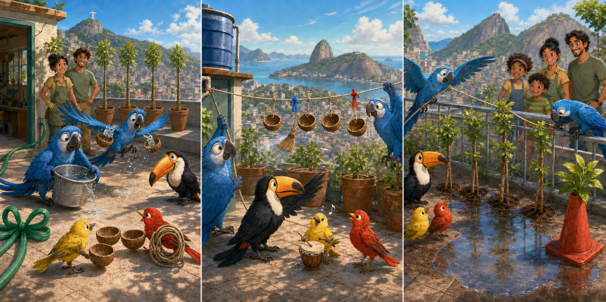

# Rio: The Rooftop Water Line

## Part 1: Water That Could Not Reach

At the bird rescue centre in Rio, Linda and Tulio planted four young trees on the roof. Children would visit that afternoon, but the hot morning had dried the soil. The hose only reached the garden door.

Blu and Jewel tried carrying water. The sea wind pushed water out of Jewel's small bowls, while Blu's large bucket was too heavy to lift safely.

Rafael said a good team did not need everyone to do the same job. Nico and Pedro arrived with three coconut cups and a coil of clothesline from their music stage. Blu studied them. "Perhaps the water can travel, even if I do not carry it," he said.

## Part 2: A Slower Rhythm

The birds tied the cups to the line and stretched it from the water tank across the garden. Jewel flew one end across while Blu kept the other beside the tank.

During the first test, Nico and Pedro pulled while singing a fast song. The cups swung, and half the water fell. Everyone stopped before the line became tangled.

Blu tied a blue ribbon at the middle and a red ribbon near the end. Rafael suggested a simple rhythm: one drumbeat meant "pull slowly", and two meant "stop". Nico played the signals, Pedro watched the cups, and Jewel held the line steady.

They tested with half-full cups. Only a little water escaped, so they filled them completely.

## Part 3: Four Healthy Trees

The system carried water safely to all four trees. On the final trip, the line caught under a metal railing. Pulling harder might break it.

Rafael stopped the signal. Jewel supported the line from the air while Blu carefully moved along the railing and freed it. Then they continued slowly.

When the children arrived, all four trees had wet soil without large puddles. Tulio said the cups gave each tree a better amount than a rushing hose.

Jewel said speed had not solved the problem. Blu agreed that testing and listening had improved their plan. Nico and Pedro played the gentle rhythm while the children watered smaller plants.

## Useful A2 Words

- **coil**: a length of rope or wire arranged in circles.
- **steady**: controlled and not moving from side to side.
- **tangled**: twisted together in a difficult way.

## Reading Questions

1. Why did Blu begin looking for a different way to move the water?
   - A. The children had asked him to build a music stage.
   - B. Flying with the available containers was not working safely.
   - C. Rafael wanted the birds to plant different kinds of trees.

2. Why was the second test more successful than the first one?
   - A. The birds used signals to control the speed and watched the cups.
   - B. Jewel replaced the coconut cups with one large bucket.
   - C. Nico and Pedro moved the water before the wind began.

3. What did the team do when the line caught under the railing?
   - A. They pulled together until the line broke free.
   - B. They left the last tree dry and welcomed the children.
   - C. They stopped, supported the line, and freed it carefully.

4. What is the main lesson of the whole story?
   - A. Testing and combining different skills can improve a plan.
   - B. The fastest worker should always control a group task.
   - C. Simple jobs become easier when people use larger tools.

## Picture Hunt

There are two picture mistakes in each panel. Can you find all six?

