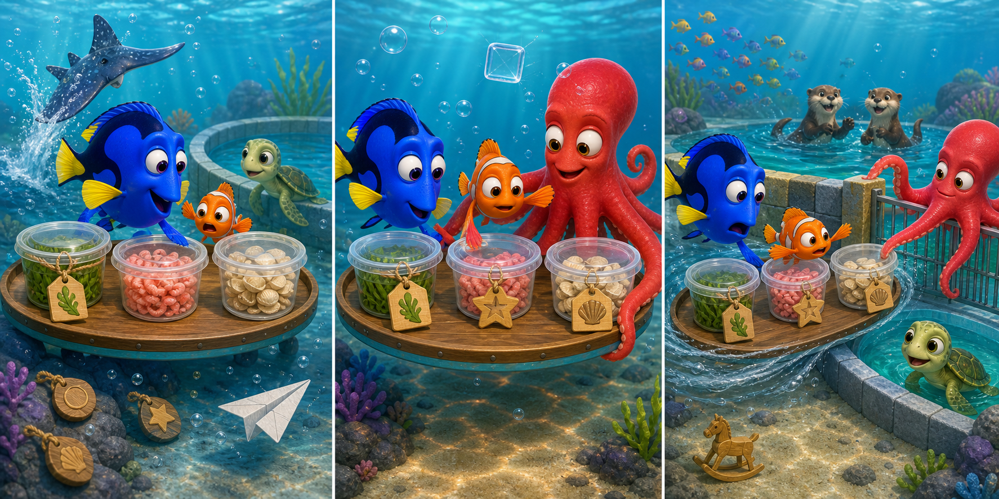

# Finding Dory: The Mixed-Up Lunch Cups

## Part 1: Three Missing Tags

At the Marine Life Institute, Dory and Nemo prepared lunch for three recovery pools. A young turtle needed green sea grass, a group of small fish needed pink shrimp, and two otters needed pieces of shellfish.

The food was inside three closed cups on a floating tray. Each cup had a different tag, but a ray splashed beside the tray. The tags came loose and sank behind some rocks.

Dory remembered the foods, but not their positions. She almost pushed the nearest cup toward the turtle pool.

“If I guess, someone may receive the wrong lunch,” she said.

Nemo suggested checking the cups for clues.

## Part 2: Clues on the Cups

Hank joined them and held the tray steady with two arms. The first cup had a green strand beneath its clear lid. Dory decided it contained sea grass.

The second cup had a tiny pink mark, but Nemo was not certain. He gently moved the cup and saw many small shapes slide together. That matched the shrimp.

When Hank moved the final cup, its contents made a light, hard sound. The friends agreed that it held the shellfish pieces.

To prevent another mix-up, Hank attached three new wooden shapes: a leaf for the turtle, a small circle for the fish, and a shell for the otters. Dory checked every clue once more.

## Part 3: Following the Evidence

As they entered the main channel, a sudden current turned the tray. The shrimp cup began floating toward the turtle pool.

Dory could not remember which cup Nemo had placed in the middle. Instead of following that memory, she looked at the wooden shapes. The cup beside the turtle gate had a circle, not a leaf.

“Wrong pool!” she called.

Nemo blocked the cup's path while Hank reached across the gate and returned it to the tray. They delivered the leaf cup to the turtle, the circle cup to the small fish, and the shell cup to the otters.

All three lunches were correct. Dory was pleased because forgetting a position had not ended the task. By checking clear evidence and asking her friends to help, she had still made a safe decision.

## Useful A2 Words

- **position**: the place where someone or something is.
- **clue**: information that helps you find an answer.
- **evidence**: facts or signs that show something is true.

## Reading Questions

1. Why did Dory stop before moving the first cup?
   - A. She realised that guessing could send food to the wrong animals.
   - B. She wanted the playful ray to choose the first recovery pool.
   - C. She had forgotten which animals lived at the institute.

2. How did Nemo become sure that the second cup held shrimp?
   - A. He found a wooden fish shape below the tray.
   - B. He saw many small pieces move behind the pink mark.
   - C. He heard the hard contents make a light sound.

3. What allowed Dory to notice that the cup was near the wrong gate?
   - A. She remembered that Nemo had put the cup in the middle.
   - B. She compared the wooden shape with the animal at the pool.
   - C. She asked the otters to describe what was inside the cup.

4. What is the main message of the whole story?
   - A. Clear evidence and teamwork can help when memory is uncertain.
   - B. A mistake is impossible when every container has the same shape.
   - C. Remembering an object's position is more useful than checking it.

## Picture Hunt

There are two picture mistakes in each panel. Can you find all six?

