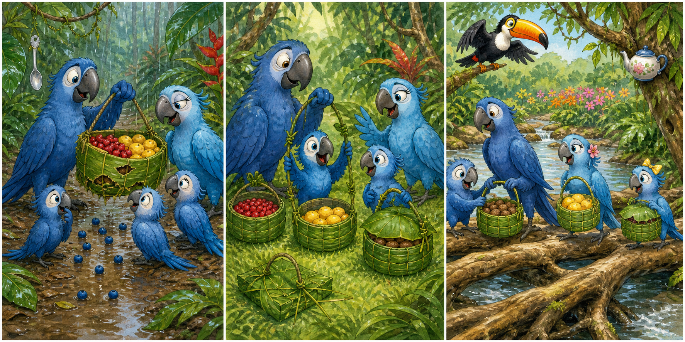

# Rio 2: The Three-Basket Crossing

## Part 1: One Basket Was Not Enough

In the Amazon forest, Jewel planned a family lunch by a flower field. Blu, Carla, Bia, and Tiago collected red berries, yellow fruit, and nuts. They had twenty-five minutes to carry everything across a narrow stream.

Blu placed all the food in one broad leaf basket. Rain had made the path wet. When he lifted the heavy basket, its soft base tore. Several berries rolled into the mud.

Carla suggested carrying fruit in their wings, but Bia said a fall could spoil more food. Blu agreed that they needed containers that matched the different weights.

## Part 2: A Useful Test

Bia folded three smaller baskets from strong palm leaves. She put berries in the first, yellow fruit in the second, and heavy nuts in the third. Tiago tied thin vines around all three handles.

Before leaving, Blu tested each basket above a clean patch of grass. The first two handles stayed firm, but the handle on the nut basket began to stretch.

“The same vine does not suit every load,” Jewel said.

Blu and Tiago replaced it with a thicker vine and added a second knot. They tested it again, and this time it held. Carla also covered the berry basket with a leaf so the small fruit could not jump out.

The family reached the stream with all three baskets ready.

## Part 3: The Safer Way Across

Flat stones usually formed a path through the water, but the rain had raised the stream. The first stone was almost covered, and Tiago wanted to jump over it.

Blu stopped him. Rafael, who was flying above the trees, noticed a group of wide roots farther upstream. The roots made a longer crossing, but they were dry and close together.

Carla carried the covered berries, Bia took the yellow fruit, and Blu and Tiago held the nut basket together. They moved slowly across the roots and reached the flower field before lunch began.

Not one piece of fruit was lost. Jewel said their careful tests had saved more time than rushing with a weak basket. Blu smiled. A good plan did not make every load the same; it gave each load the support it needed.

## Useful A2 Words

- **base**: the bottom part of an object.
- **firm**: strong and not likely to move or bend.
- **upstream**: in the direction from which a river or stream flows.

## Reading Questions

1. Why did the family decide not to carry all the fruit in one basket?
   - A. The basket was too soft for the combined weight.
   - B. The flower field only accepted three kinds of baskets.
   - C. Carla wanted to keep the yellow fruit for herself.

2. What did the basket test help the family discover?
   - A. The berries needed a thicker handle than the nuts.
   - B. One kind of vine was not strong enough for every load.
   - C. The palm leaves became weak when placed on clean grass.

3. Why did the family cross the stream using the roots?
   - A. The usual stones had become less safe after the rain.
   - B. Rafael had hidden the lunch beside the tallest root.
   - C. Tiago could carry all three baskets on the longer path.

4. What does the whole story suggest about solving a practical problem?
   - A. A careful plan should consider that different jobs have different needs.
   - B. A group finishes sooner when nobody stops to test its equipment.
   - C. The lightest items should always be carried by the strongest person.

## Picture Hunt

There are two picture mistakes in each panel. Can you find all six?

