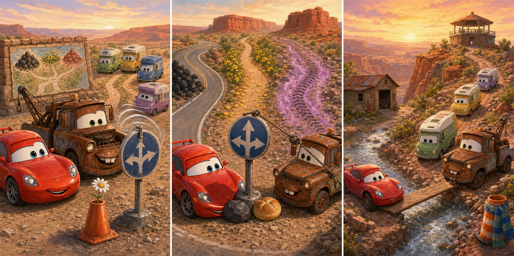

# Cars on the Road: The Red-Dust Turn

## Part 1: A Sign Facing the Wrong Way

Lightning McQueen and Mater stopped at a desert rest area. Three camper cars wanted to reach a hill lookout before sunset, but a strong wind had turned the round direction sign.

Three roads left the rest area: one smooth, one narrow, and one rough. Lightning thought the smooth road led to the lookout.

Mater noticed an old map painted on a wall. It showed black stones beside the mine road, yellow flowers near the cactus garden, and red dust on the road to the hill.

"A comfortable road is not always the correct road," Mater said.

They examined each entrance before leading the campers.

## Part 2: Three Different Clues

Lightning and Mater passed the three entrances. Black stones beside the smooth road showed that it led to the mine. Yellow petals had blown across the narrow road from the cactus garden.

At the rough road, Mater found red dust around a tyre mark. Lightning compared it with the faded map. The colour matched the hill route.

Mater used his tow cable to turn the direction sign back. Lightning placed two heavy stones behind its base so the wind could not move it again. Before returning, they followed the rough road briefly. A red cliff appeared ahead, just as the map showed.

Now they had two clues that supported their choice.

## Part 3: A Careful Final Mile

The campers followed Lightning and Mater toward the hill. Halfway there, they found a shallow space where rain had carried away part of the road. Lightning could cross it, but the smallest camper might become stuck.

Mater pulled a flat metal sheet from beside an empty repair hut. He placed it across the weak ground, and Lightning held one end firmly with a tyre. The campers crossed one at a time. Then Mater collected the sheet and left the road clear.

They reached the lookout while the sky was still gold. Lightning admitted that choosing the smoothest road would have taken them to the mine. Mater said good travellers checked clues before speed.

The camper family thanked them. Careful observation had found the right road, and patient teamwork had made it safe.

## Useful A2 Words

- **faded**: having lost some colour over time.
- **surface**: the outside or top part of something.
- **shallow**: not deep.

## Reading Questions

1. Why did Mater and Lightning examine the road entrances?
   - A. The wind had turned the sign, so the easiest-looking road might be wrong.
   - B. The camper family wanted to visit all three places before sunset.
   - C. Lightning needed to find a smooth road for a practice race.

2. What made them confident that the rough road led to the hill?
   - A. It had both red dust and a view of the red cliff shown on the map.
   - B. It was the only road with a tyre mark near its entrance.
   - C. It passed yellow flowers before reaching the cactus garden.

3. How did the friends help the smallest camper cross the weak ground?
   - A. They sent it back to wait beside the direction sign.
   - B. They used a metal sheet as a firm temporary surface.
   - C. They asked it to drive across faster than the other campers.

4. What is the main lesson of the whole story?
   - A. Checking evidence and adapting to problems can make a journey safer.
   - B. The smoothest route is usually the best choice for every traveller.
   - C. Road signs are more useful than information from the land around them.

## Picture Hunt

There are two picture mistakes in each panel. Can you find all six?

