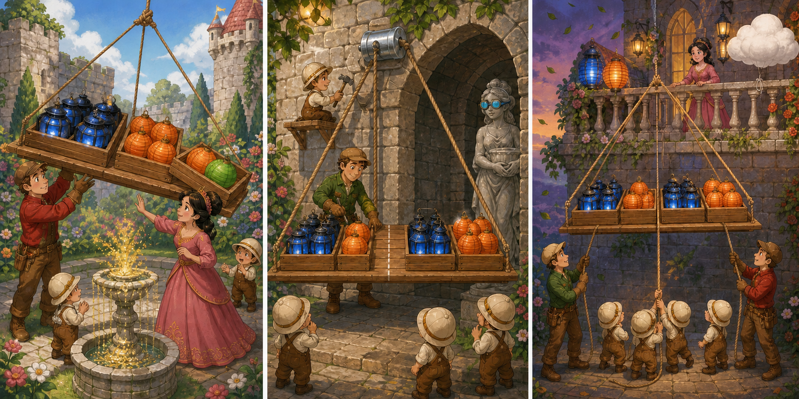

# The Super Mario Bros. Movie: The Balanced Lantern Lift

## Part 1: A Platform That Tilted

Princess Peach planned a lantern party in the castle garden. Four boxes had to reach a high balcony before the guests arrived. Two boxes held heavy blue glass lanterns, while two held light orange paper lanterns.

Mario, Luigi, and several Toads used a square platform attached to ropes. The Toads placed both heavy boxes on its left side and both light boxes on its right.

When Mario pulled the main rope, the platform tilted. One orange box began to slide toward the edge. Mario caught it, and Peach stopped the lift.

Luigi explained that the total weight was correct, but it was not balanced. They needed to change the position of the boxes before trying again.

## Part 2: Weight in the Right Places

Luigi drew a line across the platform's centre. He placed one blue box and one orange box on each side, equally far from the line.

The platform stayed level during a short test. Mario noticed white dust falling from the stone arch. The main rope was rubbing against a rough corner.

If they continued, the rope might become weak. A Toad carpenter brought a smooth wooden roller. Luigi fixed it over the corner, so the moving rope touched the roller instead of the stone.

They tested the lift again with the boxes only one metre above the ground. The platform stayed balanced, and the rope moved smoothly.

## Part 3: Two Guide Ropes

During the final lift, wind entered the garden. The platform began to swing sideways. Mario wanted to pull faster, but Peach asked everyone to pause.

The Toads attached a guide rope to each side of the platform. Mario controlled the left rope, Luigi controlled the right, and Peach watched the boxes from the balcony. They kept both ropes firm while the carpenter slowly raised the platform.

All four boxes arrived safely. The Toads hung the blue and orange lanterns before the first guests entered the garden.

Peach thanked the team for checking both the load and the equipment. Mario saw that strength alone could not keep the platform safe. Luigi's careful tests and the group's steady control had solved different parts of the same problem.

## Useful A2 Words

- **platform**: a flat raised surface used for standing or carrying things.
- **balance**: to keep weight equal on different sides.
- **guide**: to control the direction in which something moves.

## Reading Questions

1. Why did the platform tilt during the first lift?
   - A. The heavier boxes had all been placed on the same side.
   - B. Mario had pulled a rope connected to the wrong balcony.
   - C. The orange paper lanterns had become wet in the garden.

2. Why did Luigi add the wooden roller above the platform?
   - A. To make the platform carry another box.
   - B. To protect the main rope from the rough stone.
   - C. To move the centre line closer to the blue boxes.

3. How did the team control the platform in the evening wind?
   - A. They removed the glass lanterns before lifting it again.
   - B. They pulled the main rope as quickly as possible.
   - C. They held guide ropes on both sides while it rose.

4. What does the whole story suggest about completing a difficult task?
   - A. Different risks may need different careful solutions.
   - B. Strong workers can solve most problems without testing.
   - C. Light objects should always be moved before heavy ones.

## Picture Hunt

There are two picture mistakes in each panel. Can you find all six?

